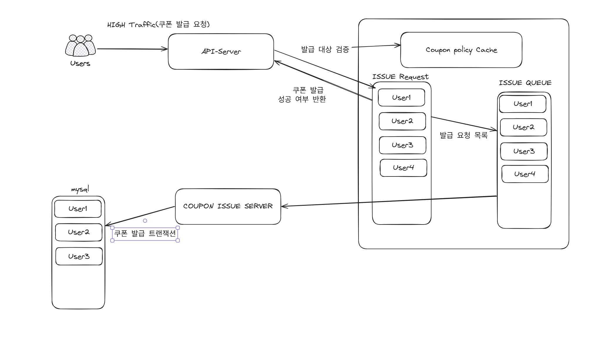

# nego-event-coupon-system
네고왕 이벤트 선착순 쿠폰 시스템 입니다.

## 아키텍처

- api 서버에서 유저의 요청을 redis를 통해서 처리를 하게 되는데 캐시를 통해서 발급 대상을 검증하고 쿠폰 발급 대상은 쿠폰 발급 대기열 큐에 적재하게된다.
- 이후 사용자에게 쿠폰 발급 성공 여부를 반환하게 된다.
- 이슈 큐의 인터페이스를 활용한 쿠폰 발급 서버가 mysql를 사용해서 트랜잭션을 처리하게 되는 그런 구조이다.

⇒ 그래서 쿠폰 발급 기능은 비동기적으로 구성되어 있다.

---

## 부하테스트
- 부하테스트는 Locust라는 툴을 사용하여 부하테스트를 진행할 것이다.
- 우선 로컬 환경에서 부하테스트 → 클라우드 환경에서 부하테스트

---

## 모니터링
- 부하테스트시 시스템의 메트릭 확인
- Aws RDS, Aws ElastiCache Metric 확인
- 로컬 환경의 모니터링 대시보드 구축

---

## 기술 스택 구성
|  |  |  |
| --- | --- | --- |
| 실습 환경 | JDK 21, Spring Boot 3.4.5, cursor, docker(docker-compose, docker-desktop) | Aws EC2 |
| 기술 분류 개발 | Spirng Data JPA & QueryDSL, Spring Data Redis, Spring Actuator & Prometheus & Grafana |  |
| 기술 분류 데이터 | Mysql8, Redis7, H2 | Aws RDS, Aws ElastiCache |
| 성능 테스트 | locust | 네트워크 트래픽 비용 |

---

## 네고왕 선착순 쿠폰 발급 이벤트란?
- 먼저 신청한 한정된 사용자들에게 쿠폰을 제공하는 이벤트 

---

## 요구사항
- 이벤트 기간 내에 발급
- 선착순 이벤트는 유저당 1개의 쿠폰 발급
- 선착순 쿠폰의 최대 쿠폰 발급 수량 설정

---

## 쿠폰 발급 기능
- 쿠폰 발급 기간 검증
- 쿠폰 발급 수량 검증
- 쿠폰 전체 발급 수량
- 중복 발급 요청 검증
- 쿠폰 발급
    - 발급 수량 증가
    - 발급 기록 저장
        - 쿠폰 Id
        - 유저 Id

---

## 구현의 목표

- 정확한 발급 수량 제어(동시성 이슈 처리)
- 높은 처리량
